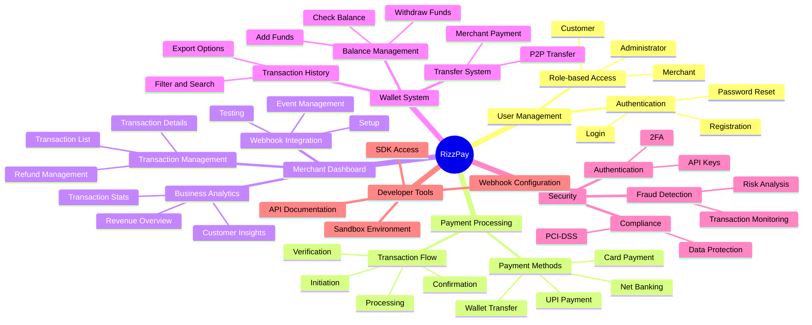

# RizzPay Application Mindmap

```mermaid
mindmap
  root((RizzPay))
    User Management
      Authentication
        Login
        Registration
        Password Reset
      Role-based Access
        Merchant
        Administrator
        Customer
    Payment Processing
      Payment Methods
        Card Payment
        UPI Payment
        Net Banking
        Wallet Transfer
      Transaction Flow
        Initiation
        Verification
        Processing
        Confirmation
    Merchant Dashboard
      Business Analytics
        Revenue Overview
        Transaction Stats
        Customer Insights
      Transaction Management
        Transaction List
        Transaction Details
        Refund Management
      Webhook Integration
        Setup
        Event Management
        Testing
    Wallet System
      Balance Management
        Check Balance
        Add Funds
        Withdraw Funds
      Transfer System
        P2P Transfer
        Merchant Payment
      Transaction History
        Filter and Search
        Export Options
    Security
      Authentication
        2FA
        API Keys
      Compliance
        PCI-DSS
        Data Protection
      Fraud Detection
        Risk Analysis
        Transaction Monitoring
    Developer Tools
      API Documentation
      SDK Access
      Webhook Configuration
      Sandbox Environment
```
